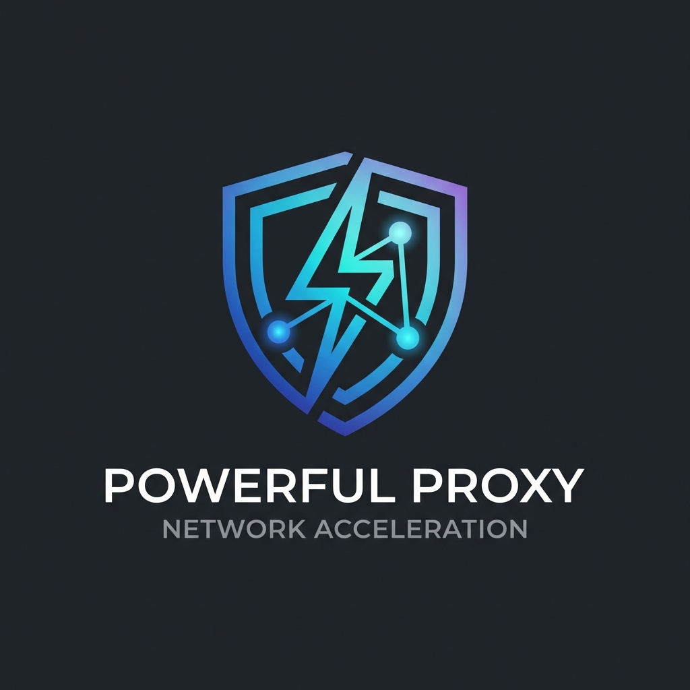

<p align="center">
  
</p>

<h1 align="center">
  
</h1>

<p align="center">
  <strong>🔥 为开发者和游戏玩家打造的高效网络加速解决方案</strong>
</p>

<p align="center">
  <a href="https://github.com/Huo-zai-feng-lang-li/Powerful-proxy/actions">
    
  </a>
  <a href="https://github.com/Huo-zai-feng-lang-li/Powerful-proxy/releases">
    
  </a>
  <a href="https://github.com/Huo-zai-feng-lang-li/Powerful-proxy/blob/main/LICENSE">
    
  </a>
  
  
</p>

<p align="center">
  <a href="#-功能亮点">功能亮点</a> •
  <a href="#-快速开始">快速开始</a> •
  <a href="#-使用指南">使用指南</a> •
  <a href="#%EF%B8%8F-高级配置">高级配置</a> •
  <a href="#-常见问题">常见问题</a>
</p>

<br/>

<p align="center">
  
</p>

---

## 📖 项目简介

> **Powerful Proxy** 是基于 [Netch](https://github.com/netchx/netch)
> 深度定制的 Windows 网络代理工具，专为开发者和游戏玩家打造。

<table>
<tr>
<td>

### ✨ 项目特色

| 特性 | 说明                                                  |
| :--: | :---------------------------------------------------- |
|  🎨  | **高清 UI** — 完美适配高分辨率显示器                  |
|  🤖  | **AI 友好** — 专为 Cursor、Antigravity 等 AI IDE 优化 |
|  ⚡  | **自动构建** — GitHub Actions 持续集成                |
|  📚  | **中文文档** — 详尽的使用说明                         |

</td>
<td>

### 🚀 核心能力

```
✓ 8+ 代理协议支持
✓ 4 种代理模式
✓ 100+ 预置规则
✓ 智能 DNS 分流
✓ NAT 类型检测
✓ 订阅自动更新
```

</td>
</tr>
</table>

---

## 💎 功能亮点

### 🌐 多协议支持

<div align="center">

|       协议       | 说明            | 状态 |
| :--------------: | :-------------- | :--: |
| **Shadowsocks**  | 轻量级加密代理  |  ✅  |
| **ShadowsocksR** | 支持混淆插件    |  ✅  |
|    **VMess**     | V2Ray 核心协议  |  ✅  |
|    **VLESS**     | 轻量 VMess 协议 |  ✅  |
|    **Trojan**    | 伪装 HTTPS 流量 |  ✅  |
|    **Socks5**    | 通用代理协议    |  ✅  |
|  **WireGuard**   | 现代 VPN 协议   |  ✅  |
|     **SSH**      | 安全隧道代理    |  ✅  |

</div>

### 🎮 代理模式

<table>
<tr>
<td width="50%" valign="top">

#### 🔷 进程代理 (NF Driver)

```
📌 精准控制指定程序流量
📌 低资源占用
📌 支持绕过规则
📌 适合日常使用
```

</td>
<td width="50%" valign="top">

#### 🔷 全局代理 (TUN)

```
📌 虚拟网卡接管全部流量
📌 完整 UDP 支持
📌 智能 DNS 分流
📌 适合游戏加速
```

</td>
</tr>
<tr>
<td width="50%" valign="top">

#### 🔷 Web 代理

```
📌 本地 HTTP/SOCKS5 端口
📌 浏览器代理扩展友好
📌 简单易配置
📌 兼容性最佳
```

</td>
<td width="50%" valign="top">

#### 🔷 pcap2socks

```
📌 游戏主机加速专用
📌 支持 PS4/PS5/Switch/Xbox
📌 无需修改主机设置
📌 低延迟体验
```

</td>
</tr>
</table>

### 🏗️ 系统架构

```
                            ┌─────────────────────────────────────┐
                            │         Powerful Proxy              │
                            └─────────────────────────────────────┘
                                            │
              ┌─────────────────────────────┼─────────────────────────────┐
              │                             │                             │
              ▼                             ▼                             ▼
     ┌─────────────────┐          ┌─────────────────┐          ┌─────────────────┐
     │   NF Driver     │          │   TUN/TAP       │          │   Xray Core     │
     │   进程级代理     │          │   全局代理       │          │   多协议核心     │
     └─────────────────┘          └─────────────────┘          └─────────────────┘
              │                             │                             │
              └─────────────────────────────┼─────────────────────────────┘
                                            │
                                            ▼
                            ┌─────────────────────────────────────┐
                            │          代理服务器                  │
                            │     (您的 SS/VMess/Trojan 节点)      │
                            └─────────────────────────────────────┘
```

---

## 🚀 快速开始

### 📋 系统要求

<div align="center">

|     项目      |                                   最低要求                                   |  推荐配置  |
| :-----------: | :--------------------------------------------------------------------------: | :--------: |
|  **💻 系统**  |                               Windows 10 1809+                               | Windows 11 |
| **⚙️ 运行时** | [.NET 8.0 Desktop Runtime](https://dotnet.microsoft.com/download/dotnet/8.0) |  最新版本  |
|  **🔐 权限**  |                                  管理员权限                                  | 管理员权限 |

</div>

### 📥 安装方式

<details open>
<summary><b>🎯 方式一：下载预编译版本（推荐）</b></summary>

<br/>

1️⃣ 前往
[**Releases**](https://github.com/Huo-zai-feng-lang-li/Powerful-proxy/releases)
页面下载最新版

2️⃣ 解压到**无中文路径**目录

```
✅ D:\Tools\Netch
✅ C:\Programs\Netch
❌ D:\工具\Netch
❌ C:\Program Files\Netch
```

3️⃣ **右键** → **以管理员身份运行** `Netch.exe`

</details>

<details>
<summary><b>🛠️ 方式二：从源码构建</b></summary>

<br/>

```powershell
# 📦 克隆仓库
git clone https://github.com/Huo-zai-feng-lang-li/Powerful-proxy.git
cd Powerful-proxy

# 🔨 执行构建
.\build.ps1 -Configuration Release -OutputPath release

# 🚀 运行程序
.\release\Netch.exe
```

</details>

### ⚡ 快速启动


---

## 📚 使用指南

### 🔗 添加服务器

<div align="center">

|      方式       | 说明             | 操作                                 |
| :-------------: | :--------------- | :----------------------------------- |
| 📥 **订阅导入** | 自动解析订阅链接 | `订阅` → `管理订阅` → 添加链接       |
|  📋 **剪贴板**  | 自动识别分享链接 | 复制链接 → `服务器` → `从剪贴板导入` |
| ✏️ **手动添加** | 逐项填写参数     | `服务器` → `添加 [协议]`             |

</div>

### 🎯 推荐模式

<table>
<tr>
<td>

#### 💼 日常办公

```yaml
模式: Bypass LAN and China
说明: 绕过国内,代理海外
推荐: ⭐⭐⭐⭐⭐
```

</td>
<td>

#### 🎮 游戏加速

```yaml
模式: Steam Games (with Steam)
说明: Steam 平台全加速
推荐: ⭐⭐⭐⭐⭐
```

</td>
<td>

#### 🤖 AI 开发

```yaml
模式: 自定义进程模式
进程: Cursor.exe, node.exe
推荐: ⭐⭐⭐⭐⭐
```

</td>
</tr>
</table>

### 🤖 AI 开发工具配置

为 **Cursor**、**Antigravity IDE** 等 AI 开发工具建议创建自定义模式：

```text
# 文件: mode/Custom/AI-Tools.txt
Cursor.exe
Antigravity.exe
Code.exe
node.exe
git.exe
npm.exe
```

---

## ⚙️ 高级配置

### 📁 预置规则及使用方法

这些是程序内置的**代理模式规则文件**，使用方法非常简单：

> **📌 使用步骤：** 在主界面的「模式」下拉框中选择对应模式 → 点击「启动」即可

```
📁 mode/
├── 📄 Bypass LAN and China    ─── 绕过国内IP（日常推荐）
├── 📄 Bypass LAN              ─── 仅绕过局域网
├── 📄 Discord                 ─── Discord 加速
├── 📄 Steam                   ─── Steam 平台
├── 📁 Game/                   ─── 游戏规则库
│   ├── 📄 Apex Legends
│   ├── 📄 PUBG
│   ├── 📄 Valorant
│   └── 📄 ...更多游戏
├── 📁 TUNTAP/                 ─── TUN 模式规则
└── 📁 Other/                  ─── 其他应用
```

#### 📋 模式类型详解

| 模式名称                 |  类型  | 原理                                 | 适用场景              |
| :----------------------- | :----: | :----------------------------------- | :-------------------- |
| **Bypass LAN and China** | IP规则 | 列出所有中国IP段，这些IP直连不走代理 | 🌐 日常上网、开发工具 |
| **Bypass LAN**           | IP规则 | 仅绕过局域网IP (192.168.x.x等)       | 🏠 局域网设备访问     |
| **Discord**              |  进程  | 仅代理 Discord.exe 进程              | 💬 Discord 语音通话   |
| **Steam**                |  进程  | 代理 Steam 全部相关进程              | 🎮 Steam 商店/社区    |
| **Game/xxx**             |  进程  | 代理特定游戏进程                     | 🕹️ 特定游戏加速       |
| **TUNTAP/xxx**           |  TUN   | 创建虚拟网卡，代理所有流量           | 🌍 全局代理/游戏      |

#### 🎯 模式选择指南

```
❓ 我该选哪个模式？

┌─ 日常浏览/开发 ─────────────▶ Bypass LAN and China ⭐推荐
│
├─ 只加速特定应用 ────────────▶ 选择对应应用模式 (如 Discord, Steam)
│
├─ 玩在线游戏 ───────────────▶ TUNTAP 模式 (完整UDP支持)
│
├─ 需要代理所有流量 ──────────▶ TUNTAP/Global 模式
│
└─ 找不到需要的应用 ──────────▶ 创建自定义模式 (见下方说明)
```

#### ✏️ 创建自定义模式

**进程模式** - 在 `mode/Custom/` 目录下创建 `.txt` 文件：

```text
# 文件名: 我的应用.txt
# 第一行格式: # 模式名称

应用1.exe
应用2.exe
子目录\应用3.exe
```

**TUN/IP模式** - 创建 `.json` 文件：

```json
{
  "Remark": "我的TUN规则",
  "Bypass": ["192.168.0.0/16", "10.0.0.0/8"],
  "Handle": ["0.0.0.0/0"]
}
```

### 🔧 DNS 设置

|    设置     | 说明           |   默认值    |
| :---------: | :------------- | :---------: |
| 🇨🇳 中国 DNS | 解析国内域名   | `223.5.5.5` |
| 🌍 海外 DNS | 解析国外域名   |  `1.1.1.1`  |
| 🔒 代理 DNS | DNS 请求走代理 |    关闭     |

### 🌐 TUN 设置

```yaml
虚拟网卡:
  地址: 10.0.236.10
  网关: 10.0.236.1
  掩码: 255.255.255.0

绕过 IP:
  - 223.5.5.5 # 阿里DNS
  - 119.29.29.29 # 腾讯DNS
  - 局域网地址
```

---

## ❓ 常见问题

<details>
<summary><b>🔴 程序无法启动</b></summary>

| 原因       | 解决方案                                                                          |
| :--------- | :-------------------------------------------------------------------------------- |
| 权限不足   | 右键 → 以管理员身份运行                                                           |
| 缺少运行时 | 安装 [.NET 8.0 Desktop Runtime](https://dotnet.microsoft.com/download/dotnet/8.0) |
| 路径有中文 | 移动到全英文路径                                                                  |
| bin 缺失   | 重新完整解压                                                                      |

</details>

<details>
<summary><b>🔴 驱动安装失败</b></summary>

```powershell
# 手动复制驱动
copy bin\wintun.dll C:\Windows\System32\

# 临时关闭杀毒软件后重试
```

</details>

<details>
<summary><b>🔴 连接超时</b></summary>

1. 测试服务器延迟：右键服务器 → 测试延迟
2. 尝试其他服务器节点
3. 检查防火墙设置
4. 查看日志：`logging\application.log`

</details>

<details>
<summary><b>🔴 游戏无法加速</b></summary>

1. 切换到 **TUN 模式**
2. 确认游戏进程名正确
3. 尝试 pcap2socks 模式
4. 检查 NAT 类型

</details>

---

## 🏛️ 项目结构

```
Powerful-proxy/
├── 📁 Netch/              ← C# 主程序
│   ├── Controllers/       ← 核心控制器
│   ├── Forms/             ← UI 界面
│   ├── Models/            ← 数据模型
│   └── Servers/           ← 协议实现
├── 📁 Redirector/         ← C++ 流量重定向
├── 📁 RouteHelper/        ← C++ 路由管理
├── 📁 Storage/            ← 预置资源
│   ├── mode/              ← 代理规则
│   └── i18n/              ← 多语言
└── 📄 build.ps1           ← 构建脚本
```

---

## 🤝 参与贡献

<table>
<tr>
<td>

### 贡献流程

```bash
# 1. Fork 仓库
# 2. 创建分支
git checkout -b feature/新功能

# 3. 提交更改
git commit -m "feat: 添加新功能"

# 4. 推送分支
git push origin feature/新功能

# 5. 发起 Pull Request
```

</td>
<td>

### 开发环境

```
📦 Visual Studio 2022+
📦 .NET 8.0 SDK
📦 MSYS2 (C++ 组件)
📦 Go 1.21+ (tun2socks)
```

</td>
</tr>
</table>

---

## 📜 开源许可

本项目采用 [**GPL-3.0**](LICENSE) 开源许可证。

### 🙏 致谢

<div align="center">

| 项目                                                                | 许可证  |
| :------------------------------------------------------------------ | :-----: |
| [Netch](https://github.com/netchx/netch)                            | GPL-3.0 |
| [Xray-core](https://github.com/XTLS/Xray-core)                      | MPL-2.0 |
| [tun2socks](https://github.com/xjasonlyu/tun2socks)                 | GPL-3.0 |
| [shadowsocks-rust](https://github.com/shadowsocks/shadowsocks-rust) |   MIT   |
| [WinTUN](https://www.wintun.net/)                                   | GPL-3.0 |

</div>

---

<p align="center">
  
</p>

<p align="center">
  <b>Made with ❤️ by <a href="https://github.com/Huo-zai-feng-lang-li">Huo-zai-feng-lang-li</a></b>
</p>

<p align="center">
  <a href="#"></a>
</p>
